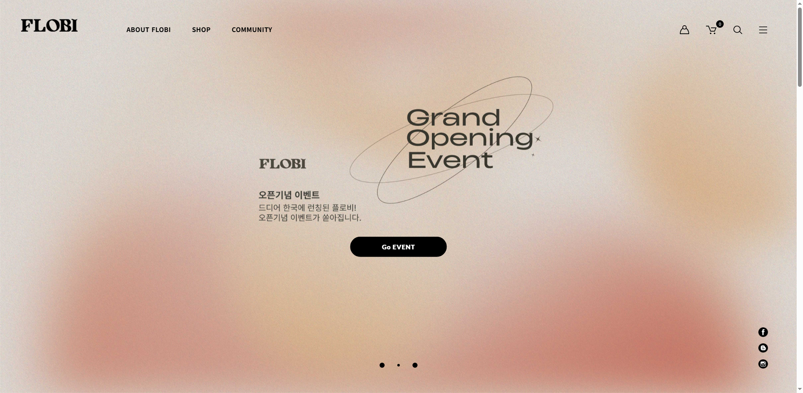

# 반응형 웹사이트 테스트 도구

다양한 화면 크기에서 웹사이트의 반응형 디자인을 테스트하고 결과를 시각적으로 확인할 수 있는 도구입니다.

## 주요 기능

- 다양한 기기 화면 크기(데스크톱, 노트북, 태블릿, 모바일)에서 웹사이트 테스트
- 스크린샷 자동 캡처
- 이미지 깨짐 분석 (비율 왜곡 확인)
- 직관적인 보고서 생성 (웹페이지, 엑셀)
- 결과 공유 기능 (카카오톡 공유 버튼)

## 사용 방법

### 1. 테스트 실행

```bash
uv run python selenium_responsive_test.py
```

### 2. 결과 보고서 생성

```bash
uv run python responsive_result_export.py
```

## 결과물

1. **엑셀 파일**: `reports/반응형테스트결과_[날짜].xlsx`
2. **웹 보고서**: `reports/index_[날짜].html`
3. **스크린샷**: `reports/images/[기기명].png`

## 필요 라이브러리

- selenium
- pandas
- openpyxl

## 테스트 대상 기기 해상도

- 데스크톱: 1920x1080
- 노트북: 1366x768
- 태블릿: 768x1024
- 모바일: 375x667

## 스크린샷



## 라이선스

MIT
